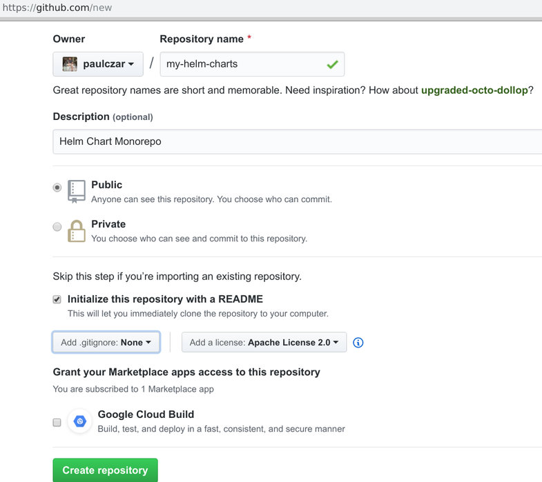
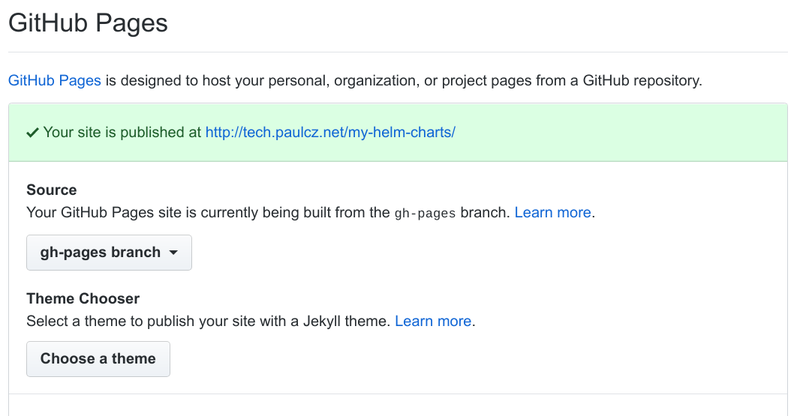
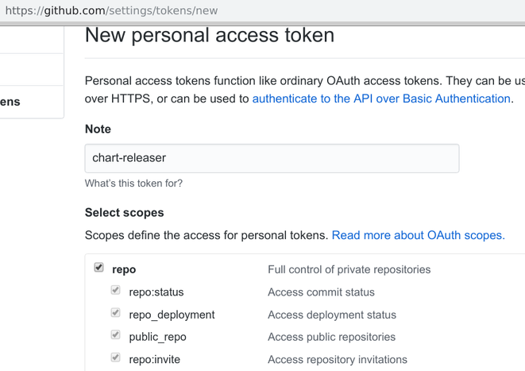
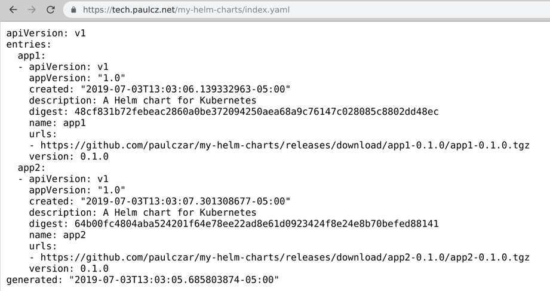

> Note: If this topic has peaked your interest, you can join me for a Webinar on August 15 where I'll dive deep into [Cloud Native Operations with Kubernetes and CI/CD Pipelines](https://content.pivotal.io/webinars/aug-15-cloud-native-operations-with-kubernetes-and-ci-cd-webinar?utm_campaign=cno-k8s-ci-cd-q319&utm_source=blog&utm_medium=website).

## Introduction

Welcome to a three part blog series on Creating a [Helm](https://helm.sh) Chart Repository. In **part 1** I will demonstrate creating a [Helm](https://helm.sh) chart repository using [GitHub](https://github.com) and [GitHub](https://github.com) Pages. In [part 2](/blog/creating-a-helm-chart-monorepo-part-2) I will add Automation to automatically update the repository, and in [part 3](/blog/creating-a-helm-chart-monorepo-part-3) I will add testing for changes to the charts themselves.

> If you're into Videos, I walked JJ through starting with Helm from scratch all the way to creating a Helm Repo and CI/CD.  

Helm is the defacto tool for packaging, sharing, and running Kubernetes Manifests. I'm going to assume you know the basics of [Helm](https://helm.sh) and have used it before. There's plenty of great introductory topics around.

You can host and share [Helm](https://helm.sh) Charts (packages) via a [Helm](https://helm.sh) Repository which is effectively a static website with an `index.yaml` providing metadata and links to the [Helm](https://helm.sh) Packages.

This makes hosting a repository perfectly suited to running in [GitHub](https://github.com) Pages, s3, google cloud storage, etc. I like to use [GitHub](https://github.com) Pages as it allows your source code and repo to live effectively in the same place.

I will walk you through creating a new [GitHub](https://github.com) Project hosting multiple [Helm](https://helm.sh) charts and demonstrate how to set up Continuous Integration with CircleCI to automatically test and publish new changes to your [Helm](https://helm.sh) Charts.

> Note: While I would usually use [Concourse CI](https://concourse-ci.org/) for my CI workflows, I wanted to *only* use managed services and I chose Circle as that is already commonly used in the Helm community.

## Create a new [GitHub](https://github.com) Repository

Log into [GitHub](https://github.com) and [create a new repository](https://github.com/new) called `my-helm-charts`. I chose to have [GitHub](https://github.com) create it as with an Apache2 License.



You can now clone down this repository and get to work:

```bash
$ git clone git@github.com:paulczar/my-helm-charts.git
Cloning into 'my-helm-charts'...
remote: Enumerating objects: 4, done.
remote: Counting objects: 100% (4/4), done.
remote: Compressing objects: 100% (3/3), done.
remote: Total 4 (delta 0), reused 0 (delta 0), pack-reused 0
Receiving objects: 100% (4/4), 4.52 KiB | 4.52 MiB/s, done.

$ cd my-helm-charts

$ tree
.
├── LICENSE
└── README.md

0 directories, 2 files
```

You can see we have a default LICENSE file and a default README.md, we can leave them alone for now. Your next step is to create a couple of [Helm](https://helm.sh) charts. Since this is purely for demonstration purposes they don't have to be overly functional charts which means we can just use the default boilerplate created by `helm create`.

> You do have [helm](https://github.com/helm/helm#install) installed right?

```bash
$ mkdir charts

$ [Helm](https://helm.sh) create charts/app1
Creating charts/app1

$ [Helm](https://helm.sh) create charts/app2
Creating charts/app2

$ tree
.
├── charts
│   ├── app1
│   │   ├── charts
│   │   ├── Chart.yaml
│   │   ├── templates
│   │   │   ├── deployment.yaml
│   │   │   ├── _helpers.tpl
│   │   │   ├── ingress.yaml
│   │   │   ├── NOTES.txt
│   │   │   ├── service.yaml
│   │   │   └── tests
│   │   │       └── test-connection.yaml
│   │   └── values.yaml
│   └── app2
│       ├── charts
│       ├── Chart.yaml
│       ├── templates
│       │   ├── deployment.yaml
│       │   ├── _helpers.tpl
│       │   ├── ingress.yaml
│       │   ├── NOTES.txt
│       │   ├── service.yaml
│       │   └── tests
│       │       └── test-connection.yaml
│       └── values.yaml
├── LICENSE
└── README.md

9 directories, 18 files
```

Push these changes to git:

```bash
echo ".deploy" >> .gitignore

$ git add .

$ git commit -m 'Initial Commit'
[master 2172141] Initial Commit
 18 files changed, 524 insertions(+)
...
...

$ git push origin master
Enumerating objects: 27, done.
Counting objects: 100% (27/27), done.
Delta compression using up to 4 threads
Compressing objects: 100% (24/24), done.
Writing objects: 100% (26/26), 4.72 KiB | 536.00 KiB/s, done.
Total 26 (delta 8), reused 0 (delta 0)
remote: Resolving deltas: 100% (8/8), done.
To github.com:paulczar/my-helm-charts.git
   abdcced..2172141  master -> master
```


## Publish your [Helm](https://helm.sh) Repository

### Prepare [GitHub](https://github.com) Pages

We're going to use a combination of [GitHub](https://github.com) Pages and releases to host our [Helm](https://helm.sh) Repository. Therefore we need to ensure we have [GitHub](https://github.com) Pages enabled on the git repo and to create an empty `gh-pages` branch.

You can create an empty `gh-pages` branch by creating an orphan branch like so:

```
$ git checkout --orphan gh-pages
Switched to a new branch 'gh-pages'

$ rm -rf charts

$ git add . --all

$ git commit -m 'initial gh-pages'
git commit -m 'initial gh-pages'
[gh-pages a9ce382] initial gh-pages
 18 files changed, 524 deletions(-)
...
...

$ git push origin gh-pages
Enumerating objects: 3, done.
...
...
To github.com:paulczar/my-helm-charts.git
 * [new branch]      gh-pages -> gh-pages
```

Next check that [GitHub](https://github.com) Pages is enabled by clicking on your git repo settings in GitHub:



> Note: I have a custom domain set up, your URL will probably be username.github.io/my-helm-charts.

After a few minutes you should have a default rendering on your README.md at the provided URL:

 ages](./default-gh-pages.png)

### Introducing chart-releaser

You could use a combination of `helm package` and `helm repo` commands to construct your [Helm](https://helm.sh) repository by hand, or you can simplify your life by using `chart-releaser` which will not only create your packages, but will upload them as binaries into an appropriately versioned [GitHub](https://github.com) Release.

Download chart-releaser for your architecture [here].

> Note: I'm doing this on a linux machine, so you may need to update the commands below for Mac OS.

In a new terminal download and unpackage it, moving it to an executable path:

```bash
cd /tmp
$ curl -sSL https://github.com/helm/chart-releaser/releases/download/v0.2.1/chart-releaser_0.2.1_linux_amd64.tar.gz | tar xzf -

$ mv cr ~/bin/cr

$ cr help
Create [Helm](https://helm.sh) chart repositories on [GitHub](https://github.com) Pages by uploading Chart packages
and Chart metadata to [GitHub](https://github.com) Releases and creating a suitable index file

Usage:
  cr [command]

Available Commands:
  help        Help about any command
  index       Update Helm repo index.yaml for the given GitHub repo
  upload      Upload Helm chart packages to GitHub Releases
  version     Print version information

Flags:
      --config string   Config file (default is $HOME/.cr.yaml)
  -h, --help            help for cr

Use "cr [command] --help" for more information about a command.
```

There are two commands we care about `cr index` and `cr upload`, the first will create an appropriate `index.yaml` and the second will upload the packages to [GitHub](https://github.com) Releases. In order to do the latter you'll need to pass it in a [GitHub](https://github.com) Token so that it can use the [GitHub](https://github.com) APIs.

In your browser go to your [github developer settings](https://github.com/settings/tokens) and create a new personal access token.



Create an environment variable (or a `~/.cr.yaml` config file) containing the access token:

> Pro-tip: put an additional space in your command right before ` export` and it won't be saved to your command history.

```bash
$  export CH_TOKEN=c4a4ed6ab91a246572b0c46c19c630ccadc1049
```

### Create and Upload [Helm](https://helm.sh) Packages

Your next step is to create and upload the packages:

```bash
$ Helm package charts/{app1,app2} --destination .deploy
Successfully packaged chart and saved it to: .deploy/app1-0.1.0.tgz
Successfully packaged chart and saved it to: .deploy/app2-0.1.0.tgz
```

Run `cr upload` to create releases and upload the packages, note if it runs correctly there's no output.

```bash
$ cr upload -o paulczar -r my-helm-charts -p .deploy
```

Check your [GitHub](https://github.com) repository now has a releases page with two releases:


### Create and upload index file to [GitHub](https://github.com) Pages

Checkout your `gh-pages` branch and run `cr index`:

```bash
$ git checkout gh-pages

$ cr index -i ./index.yaml -p .deploy --owner paulczar --repo my-helm-charts
====> UpdateIndexFile new index at ./index.yaml
====> Found app1-0.1.0.tgz
====> Extracting chart metadata from .deploy/app1-0.1.0.tgz
====> Calculating Hash for .deploy/app1-0.1.0.tgz
====> Found app2-0.1.0.tgz
====> Extracting chart metadata from .deploy/app2-0.1.0.tgz
====> Calculating Hash for .deploy/app2-0.1.0.tgz
--> Updating index ./index.yaml
```

There should now be a `index.yaml` file containing the details of your [Helm](https://helm.sh) packages and the path to their archive:

```bash
$ cat index.yaml
apiVersion: v1
entries:
  app1:
  - apiVersion: v1
    appVersion: "1.0"
    created: "2019-07-03T13:03:06.139332963-05:00"
    description: A Helm chart for Kubernetes
    digest: 48cf831b72febeac2860a0be372094250aea68a9c76147c028085c8802dd48ec
    name: app1
    urls:
    - https://github.com/paulczar/my-helm-charts/releases/download/app1-0.1.0/app1-0.1.0.tgz
    version: 0.1.0
  app2:
  - apiVersion: v1
    appVersion: "1.0"
    created: "2019-07-03T13:03:07.301308677-05:00"
    description: A Helm chart for Kubernetes
    digest: 64b00fc4804aba524201f64e78ee22ad8e61d0923424f8e24e8b70befed88141
    name: app2
    urls:
    - https://github.com/paulczar/my-helm-charts/releases/download/app2-0.1.0/app2-0.1.0.tgz
    version: 0.1.0
generated: "2019-07-03T13:03:05.685803874-05:00"
```

Commit this to git and then wait a few minutes and check that it exists in your [GitHub](https://github.com) Pages url:

```bash
$ git add index.yaml

$ git commit -m 'release 0.1.0'
[gh-pages 696df18] release 0.1.0
 1 file changed, 23 insertions(+)
 create mode 100644 index.yaml

$ git push origin gh-pages
...
To github.com:paulczar/my-helm-charts.git
   75f1fe8..696df18  gh-pages -> gh-pages
```

Check it exists in [GitHub](https://github.com) Pages:



### Test your new [Helm](https://helm.sh) Repostiory

> Note: To do this you'll need a Kubernetes cluster with Helm's tiller installed, but you already know how to do that right?

```
$ helm repo add my-helm-charts https://tech.paulcz.net/my-helm-charts
"my-helm-charts" has been added to your repositories

$ helm install --name test --namespace test my-helm-charts/app1
NAME:   test
LAST DEPLOYED: Wed Jul  3 13:17:32 2019
NAMESPACE: test
STATUS: DEPLOYED

RESOURCES:
==> v1/Deployment
NAME       READY  UP-TO-DATE  AVAILABLE  AGE
test-app1  0/1    1           0          0s

==> v1/Pod(related)
NAME                        READY  STATUS             RESTARTS  AGE
test-app1-7b575d95f6-zhlh2  0/1    ContainerCreating  0         0s

==> v1/Service
NAME       TYPE       CLUSTER-IP      EXTERNAL-IP  PORT(S)  AGE
test-app1  ClusterIP  10.100.200.213  <none>       80/TCP   0s


NOTES:
1. Get the application URL by running these commands:
  export POD_NAME=$(kubectl get pods --namespace test -l "app.kubernetes.io/name=app1,app.kubernetes.io/instance=test" -o jsonpath="{.items[0].metadata.name}")
  echo "Visit http://127.0.0.1:8080 to use your application"
  kubectl port-forward $POD_NAME 8080:80
```

Check that it deployed ok:

```bash
$ kubectl -n test get all
NAME                             READY   STATUS    RESTARTS   AGE
pod/test-app1-7b575d95f6-zhlh2   1/1     Running   0          42m

NAME                TYPE        CLUSTER-IP       EXTERNAL-IP   PORT(S)   AGE
service/test-app1   ClusterIP   10.100.200.213   <none>        80/TCP    42m

NAME                        READY   UP-TO-DATE   AVAILABLE   AGE
deployment.apps/test-app1   1/1     1            1           42m

NAME                                   DESIRED   CURRENT   READY   AGE
replicaset.apps/test-app1-7b575d95f6   1         1         1       42m
```

Clean up:

```bash
$ helm delete --purge test
release "test" deleted
```

### Update the README.md with instructions on using

switch back to your `master` brach:

```bash
$ git checkout master
```

Edit your README.md to provide details on how to use charts from your repository:

```markdown
# My [Helm](https://helm.sh) Charts

This repository contains [Helm](https://helm.sh) charts for various projects

* [Application 1](charts/app1/)
* [Application 2](charts/app2/)

## Installing Charts from this Repository

Add the Repository to Helm:

    helm repo add my-helm-charts https://tech.paulcz.net/my-helm-charts

Install Application 1:

    helm install my-helm-charts/app1

Install Application 2:

    helm install my-helm-charts/app2
```

Commit the change up to GitHub:

```bash
$ git add README.md
$ git commit -m 'update readme with instructions'
$ git push origin master
...
```

## Conclusion

That's the end of **Part 1** of this three part series. In future posts I will demonstrate adding [automation](/blog/creating-a-helm-chart-monorepo-part-2) and [testing](/blog/creating-a-helm-chart-monorepo-part-3) to this [Helm](https://helm.sh) chart repository.
