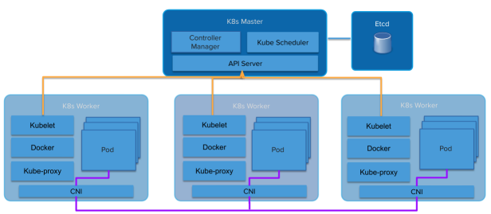
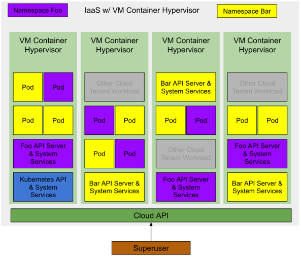

## Peering into the crystal ball

Kubernetes as a technology has been very important to my career this year, and will be even more so for next year too. As 2018 comes to a close its time to drag out the hubris and make a bold prediction. The future of Kubernetes is Virtual Machines, not Containers.

> __The future of Kubernetes is Virtual Machines, not Containers.__

The Chinese Zodiac calls 2018 the year of the Dog, in tech it was the year of the Kubernetes. There are plenty of people only now learning about Kubernetes. CIOs everywhere are hard at work trying to develop a "Kubernetes Strategy" [1]. Some organizations are already running large production workloads on Kubernetes.

_[1] If you're trying to develop a Kubernetes strategy you've already failed, but that's a different blog post._

In other words there are plenty of people at each stage of the Gartner Hype Cycle for Kubernetes. Many are stuck in the trough of disillusionment or have drowned in the pit of despair.

__Jeremykemp at [Wikipedia](https://commons.wikimedia.org/wiki/File:Gartner_Hype_Cycle.svg) [Creative Commons CC BY-SA 3.0](https://creativecommons.org/licenses/by-sa/3.0)__

I am a big fan of containers and I'm not going to try to suggest that [containers are dead](https://chrisshort.net/docker-inc-is-dead/). What Docker brought us in 2013 was a wrapper around Linux Containers. They showed us an amazing new way to build, package, share, and deploy applications.  This came at exactly the right time as we had started to get serious about Continuous Delivery.  Their model was perfect for the modern delivery pipeline and the emergence of PaaS and later CaaS platforms.

Engineers working at Google saw the technology community was finally ready for containers. Google has been using (and more or less invented) containers for a very long time already. They started to build Kubernetes which as we all know by now is a re-imagining of Google's own Borg platform built in the open as a community effort.

It didn't take long for the big public clouds to provide a Kubernetes based platform (GKE, AKS, EKS).  The on premise folks were also quick to build platforms based on Kubernetes as well (Pivotal Container Service, Openshift, etc).

## Soft and Squishy Multi-Tenancy

There's one sticky problem that's left to solve, and this I believe will prove to be the downfall of the container ...  multi-tenancy.

Linux containers were not built to be secure isolated sandboxes (like Solaris Zones or FreeBSD Jails). Instead they're built upon a shared kernel model that utilizes kernel features to provide basic process isolation. As [Jessie Frazelle](https://blog.jessfraz.com/post/containers-zones-jails-vms/) would say "Containers aren't a real thing".



Compounding this is the fact that most Kubernetes components are not Tenant aware. Sure you have [Namespaces](https://kubernetes.io/docs/concepts/overview/working-with-objects/namespaces/) and [Pod Security Policies](https://kubernetes.io/docs/concepts/policy/pod-security-policy/) but the API itself is not. Nor are the internal components like the `kubelet` or `kube-proxy`. This leads to Kubernetes having a "Soft Tenancy" model.

Abstractions leak. A platform built on top of containers will inherit many of the soft tenancy aspects of containers. Platforms built on top of hard multi-tenancy Virtual Machines all inherit that hard tenancy (VMWare, Amazon Web Services, Openstack, etc).

The Kubernetes cluster itself becomes the line of "Hard Tenanacy". This leads to the emerging pattern of "many clusters" rather than "one big shared" cluster. Its not uncommon to see customers of Google's GKE Service have dozens of Kubernetes clusters deployed for multiple teams. Often each developer gets their own cluster. This kind of behavior leads to a shocking amount of Kubesprawl.

> __"This kind of behavior leads to a shocking amount of Kubesprawl"__

Generally the smallest cluster you get is 4 machines (or VMs). One (or 3 for HA) for the Kubernetes Master, three for the Kubernetes Workers. This ties up a ton of money in systems that are for the most part just sitting there idle.

So we need to somehow move Kubernetes to a hard-tenancy model. The Kubernetes community is very aware of this need and has a [multi-tenancy working group](https://groups.google.com/forum/#!forum/kubernetes-wg-multitenancy). This group has working hard on that problem and they have several suggested models and proposals on how to solve each model.

Jessie Frazelle wrote a [blog post](https://blog.jessfraz.com/post/hard-multi-tenancy-in-kubernetes/)  about this exact topic which is great because she's much smarter than me so I can link you to her and save myself about ten years of hard study trying to catch up to her. If you have not read it, stop reading here and go read it first.

## Just make really small VMs optimized for speed...

> Kata Containers is an open source project and community working to build a standard implementation of lightweight Virtual Machines (VMs) that feel and perform like containers, but provide the workload isolation and security advantages of VMs.

Jessie suggests using a VM Container technology such as [Kata Containers](https://katacontainers.io/). Kata Containers combine Virtual Machine level isolation that act and perform like Containers. This allows Kubernetes to give each Tenant (we'll assume a tenant per namespace) its own set of Kubernetes system services running in nested VM Containers (A VM Container running inside a VM provided by the underlying IaaS).

__image from [Jessie Frazelle - Hard Multi-Tenancy in Kubernetes](https://blog.jessfraz.com/post/hard-multi-tenancy-in-kubernetes/)__

This is an elegant solutions to Kubernetes multi-tenancy. Her suggestion goes even further to suggest that Kubernetes use nested Container VMs for the workloads (Pods) running on Kubernetes which provides a significant increase of resource utilization.

We have at least one more optimization to make here. Build out a suitable Hypervisor for the underlying IaaS or cloud provider. If a VM Container is a first level abstraction provided by the IaaS then we increase our resource utilization even further. The minimal number of VMs required to run a Kubernetes cluster goes down to one (or three for HA) to host the Kubernetes control plane exposed to the "Superuser".

## Resource (cost) Optimized Multi-tenancy

A Kubernetes deployment with two namespaces both with a number of applications running would look something like this.

> Note: there are other cloud tenant workloads running on the same IaaS infrastructure. Since these are VM Containers they have the same level of isolation as a regular Cloud VM. Thus they can run on the same hypervisor with minimal risk.

Initially there is zero infrastructure deployed to the cloud, thus there is zero cost to the Superuser. 

The Superuser requests a Kubernetes cluster from the cloud. The Cloud provider creates a single Container VM (or 3 for HA) which is running the main Kubernetes API and System Services. The Superuser could choose to deploy pods in the system namespace, or create new namespaces to delegate access to other users.

The Superuser create two Namespaces `foo` and `bar`. Kubernetes requests two VM containers from the Cloud for each Namespace's Control Plane (Kubernetes API and System Services). The Superuser delegates access to those Namespaces to some users who each deploy some workloads (Pods), their respective Control Planes request VM containers for each of those workloads.

At all stages of this, the superuser is only paying for the actual consumed resources. The cloud provider owns the capacity which is available to any user of the cloud.

## I'm not actually saying anything new here ...

The cloud providers are already working towards this future. You can see this forming by watching what is happening in the Open Source Communities. (Arguably Amazon is already doing this opaquely with Fargate).

The first hint is [Virtual Kubelet](https://github.com/virtual-kubelet/virtual-kubelet) which is an open source tool designed to masquerade as a kubelet.  It connects Kubernetes to other APIs. This would allow Kubernetes to request Container VMs from a Cloud's Container VM scheduler.

Other hints are the number of emerging VM Container technologies, the already mentioned [Kata Containers](https://katacontainers.io/), but also [Firecracker from Amazon](https://aws.amazon.com/blogs/opensource/firecracker-open-source-secure-fast-microvm-serverless/) and [gvisor](https://github.com/google/gvisor) from Google.

## Conclusion

Tied together with the correct improvements to the Kubernetes hard tenancy model and you'll arrive at the holy grail of Kubernetes.  Full isolation of Kubernetes workloads and a pure per Pod consumption cost model to run workloads on Kubernetes.

For those who aren't on the public cloud, we don't get the same consumption model as the onus for capacity remains with the infrastructure provider (in this case yourself). You will still get the benefits of higher resource utilization which pays off in lower capacity requirements.

Let's hope VMWare and Openstack are paying attention and bring us lightweight VM Container technology based hypervisors and the appropriate Virtual Kubelet implementations.