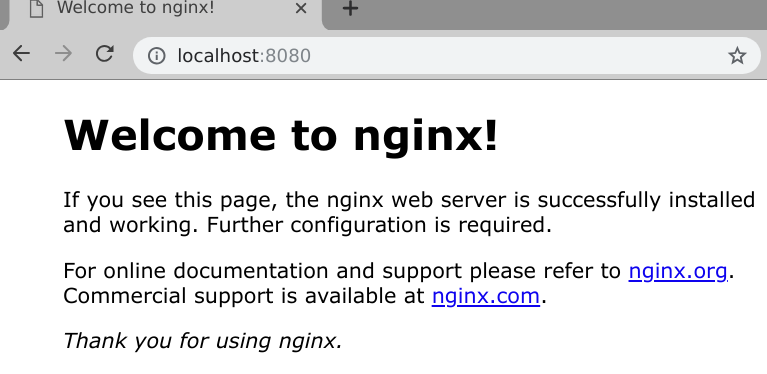
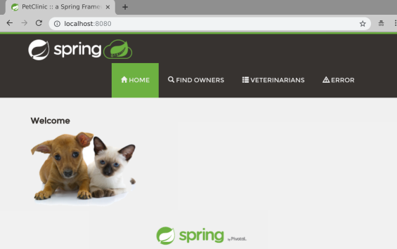
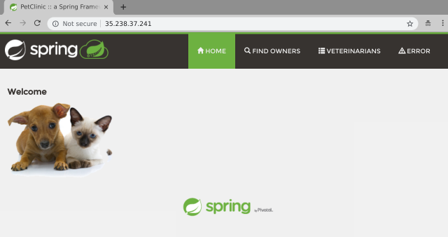

# Introduction

In this installment of Spring into Kubernetes we'll be looking at using [Helm](https://helm.sh/) to install our Spring application to Kubernetes.

# About Helm

[Helm](https://helm.sh/) is the package manager for Kubernetes. It provides tooling to create, template, package, and [share](https://hub.helm.sh/) Kubernetes manifests. A helm chart is effectively a signed tarball that contains a set of templated Kubernetes manifests, a metadata file and a set of default values.

Helm has two major components, the Helm client and the Tiller server. The Helm client is a CLI tool that you use to create, package and deploy helm charts. The Tiller server is installed into your Kubernetes cluster and is responsible for managing the lifecycle of your applications as instructed by the Helm client.

> Note: The Tiller server was created before Kubernetes extensions existed and will be removed in Helm 3 in favor of utilizing Kubernetes extensions. You can also use "tillerless" Helm but that's out of scope for this blog post.

Helm charts can be shared via a Helm Repository which gives you an easy way to upload, share, and download packages from a central location. The public [Helm Hub](https://hub.helm.sh/) has prebuilt Helm packages for most common open source applications.

# Step 1 - Install Helm

[Installing Helm](https://docs.helm.sh/using_helm/#installing-helm) is quite simple, if you're on a Mac you can install Helm via Homebrew, otherwise check the [Helm install documentation](https://docs.helm.sh/using_helm/#installing-helm) for platform specific instructions:

```console
brew install kubernetes-helm
```

With the Helm client installed you can install the Tiller server to your Kubernetes cluster.

If you are using minikube or a single tenant Kubernetes cluster without Role Based Authentication Control (RBAC) enabled you can deploy Tiller by simply running `helm init`. On most clusters you should create a service account and role binding first like so:

```console
kubectl -n kube-system create serviceaccount tiller
kubectl create clusterrolebinding tiller --clusterrole cluster-admin --serviceaccount=kube-system:tiller
helm init --service-account=tiller
```

After a minute or so you can check it has finished installing by running `helm version` which will give you the version of both the client and the server. If the server doesn't respond just want a few more moments and try again:

```console
$ helm version
Client: &version.Version{SemVer:"v2.12.2", GitCommit:"7d2b0c73d734f6586ed222a567c5d103fed435be", GitTreeState:"clean"}
Server: &version.Version{SemVer:"v2.12.2", GitCommit:"7d2b0c73d734f6586ed222a567c5d103fed435be", GitTreeState:"clean"}
```

# Step 2 - Create and Deploy a new Helm Chart

Use the Helm client to create a new Helm chart:

```console
$ helm create petclinic
Creating petclinic

$ cd petclinic

$ tree
├── charts
├── Chart.yaml
├── templates
│   ├── deployment.yaml
│   ├── _helpers.tpl
│   ├── ingress.yaml
│   ├── NOTES.txt
│   ├── service.yaml
│   └── tests
│       └── test-connection.yaml
└── values.yaml

```

You can see that the Helm chart sets up a boilerplate Helm chart to get you started. This is actually a fully functioning chart so you can go ahead and deploy it right away to ensure that everything is working correctly. You could simply run `helm install .` but generally you'll want to specify a namespace and release name by using the `--namespace` and `--name` for better management.

```console
$ helm install --namespace test --name test .
NAME:   test
LAST DEPLOYED: Tue Feb  5 06:26:19 2019
NAMESPACE: test
STATUS: DEPLOYED
...
...
```

You can use `kubectl port-forward` to test that everything worked right:

```console
$ kubectl --namespace test port-forward deployment/test-petclinic 8080:80
Visit http://127.0.0.1:8080 to use your application
Forwarding from [::1]:8080 -> 80
Forwarding from 127.0.0.1:8080 -> 80
```

Point your browser at http://localhost:8080 and you should see the following:



But this isn't Petclinic it's an empty nginx container. Since our petclinic app is pretty simple we can use this boilerplate chart to deploy Petclinic with just a few minor changes.

* The nginx app inside the container listens on port 80, petclinic listens on port 8080 so you'll need to edit the file `templates/deployment.yaml` and find the YAML `containerPort: 8080` under the container spec and change the value to `8080`.

* Also in the `templates/deployment.yaml` file you want to increase the initial timeout for the `livenessCheck` check as Java takes longer to be ready than nginx. Find the YAML key `livenessProbe:` and add the keypair `initialDelaySeconds: 60` to it.

The updated section of the `templates/deployment.yaml` should look like this:

```yaml
    spec:
      containers:
        - name: {{ .Chart.Name }}
          image: "{{ .Values.image.repository }}:{{ .Values.image.tag }}"
          imagePullPolicy: {{ .Values.image.pullPolicy }}
          ports:
            - name: http
              containerPort: 8080
              protocol: TCP
          livenessProbe:
            initialDelaySeconds: 60
            httpGet:
              path: /
              port: http

```

> Note: the double curly brace `{{ }}` signifies for the golang templating engine to process some code, usually print out some values, but can also be used for if/then statements and loops.

You also need to set the image and tag to petclinic. You could edit `values.yaml` to change the defaults, but you can also override default values with `--set`. Since we've already deployed the helm chart we can _upgrade_ it by running a `helm upgrade` and providing the appropriate `--set` flag like so:

> Note: `helm upgrade` helps you to manage the release lifecycle of your application, Tiller keeps track of the releases that you've deployed and helps you both upgrade and rollback deployments.

```console
$ helm upgrade test \
  --set image.repository=paulczar/spring-petclinic \
  --set image.tag=latest .
Release "test" has been upgraded. Happy Helming!
LAST DEPLOYED: Tue Feb  5 06:54:07 2019
...
...
```

Forward port 8080 through to the deployment again and check its working via your web browser:

> Note: the command shown in the `helm upgrade` output is wrong because we're using port 8080 now, you could fix the output by editing the file `templates/NOTES.txt`, but for now just run the command below.

```console
$ kubectl --namespace test port-forward deployment/test-petclinic 8080
Forwarding from [::1]:8080 -> 8080
Forwarding from 127.0.0.1:8080 -> 8080
```



# Step 3 - Cleanup

To uninstall the helm chart simple run the following command:

```console
$ helm delete --purge test
release "test" deleted
```

# Step 4 (optional) - Package your Helm Chart

Helm charts are designed to be packaged and shared via a Helm repository. Simply running `helm package .` will create the Helm package like so:

```console
$ mkdir pkg
$ helm package -d pkg .
Successfully packaged chart and saved it to: /tmp/petclinic/petclinic-0.1.0.tgz
```

These packages combined with an index file can be hosted on any static website (github pages is very common) to create a Helm Repository. You can generate the index file with:

```console
$ helm repo index pkg
$ cat pkg/index.yaml
apiVersion: v1
entries:
  petclinic:
  - apiVersion: v1
    appVersion: "1.0"
    created: 2019-02-06T02:45:10.99990157-06:00
    description: A Helm chart for Kubernetes
    digest: 86f3740e6bc325ea330428e42af091d6613ca9b92678b3aecdf680f0302b4685
    name: petclinic
    urls:
    - petclinic-0.1.0.tgz
    version: 0.1.0
generated: 2019-02-06T02:45:10.99955354-06:00
```

You can use any basic web server as a Helm repository, many folks are using [github pages](https://github.com/int128/helm-github-pages) which is quite a clever way to host your Helm Repository right next to the actual code for your Helm chart.

# Step 5 - Use a Helm Repository

I have created a more featureful Helm Chart designed specifically to generically run most Spring applications which can be found on my github repo [helm-chart-spring](https://github.com/paulczar/helm-chart-spring). It installs petclinic by default and has options to be able to automatically set up LoadBalancers and Ingress as well as more advanced kubernetes resources such as `podDisruptionBudgets`.

You can install it straight from my Helm Repository like so:

```console
$ helm repo add paulczar http://tech.paulcz.net/helm-chart-spring/repo
"paulczar" has been added to your repositories

$ helm install --namespace test --name test \
    paulczar/spring --set service.type=LoadBalancer \
    --version 0.0.6
```

After a few moments you should be able to access the petclinic app via the LoadBalancer created by the above command.  Run `kubectl get svc` to find the IP:

```console
$ k get svc
NAME          TYPE           CLUSTER-IP       EXTERNAL-IP      PORT(S)        AGE
test-spring   LoadBalancer   10.100.200.137   35.238.37.241   80:30509/TCP   89s
```

Point your browser at the `EXTERNAL-IP` value:



Uninstall the Helm chart:

```console
$ helm delete --purge test
release "test" deleted
```

# Summary

Helm has made it incredibly easy to get started creating and customizing charts to install Applications on Kubernetes. By templating and packaging your Kubernetes manifests you get an easy to share package for your application and are able to enable a lot of deployment flexibility to deploy multiple releases of your application to one or many Kubernetes clusters and customize things like the service type giving you tremendous control over how people access it.

Better yet, if you are looking to install an open source application you should first look to the [Helm Hub](https://hub.helm.sh/) which is a public repository of hundreds of pre-packaged helm charts that install with just a few keypresses.
